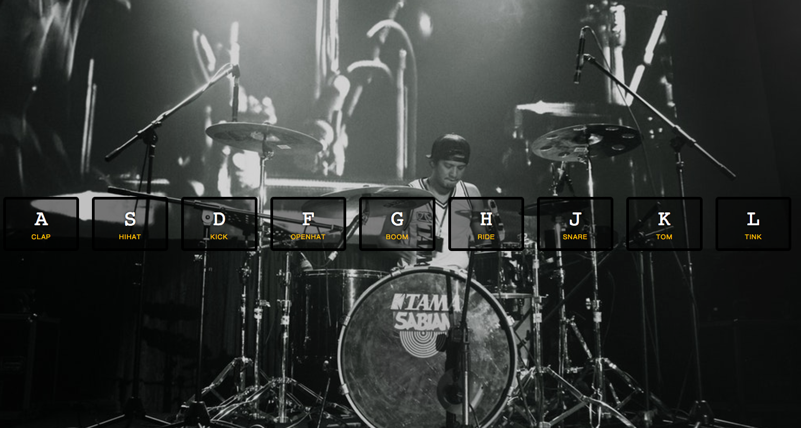

## Key point

1. Use data attribute like `data-key` for customized your selector, not always using `class`
2. Use `Array.from` to form array object from `Array-Like` JS object (like [NodeList](https://developer.mozilla.org/zh-CN/docs/Web/API/NodeList) from `querySelectorAll`)
3. We can add `transitionend` event listener! and the `e.propertyName` will show which property is being transitionend.

## Notes

I thought I can use `transition: transform .07s ease;` instead of adding condition in `removeTransition` function, but soon to realize other style like `border-color` won't be transitioned.

