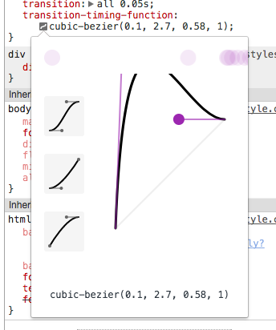

## Key point

1. Use `transform-origin`, `transform: rotate(90deg);`, `transition` and `transition-timing-function` properly.
2. The transition-timing-function we use in this project: `cubic-bezier(0.1, 2.7, 0.58, 1)`, will generate a bouncing effect

    

## Notes

If you want to use different `width` to diff hour, minutes and seconds hands, need to ajust the left or right position, due to element position in `absolute`(position decided by outer `relative` block).
