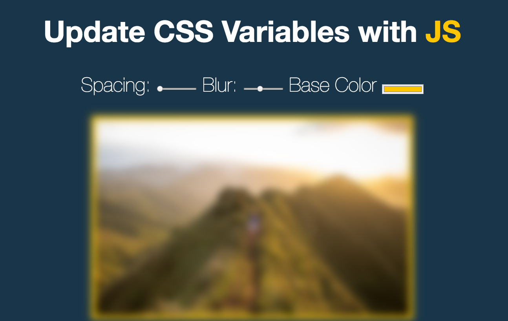

## Key point

1. `:root` is a sepcial key for scope css, define your css variable in here
2. For enabling DnD input slider to change variable value, not only listen `change` event but also `mouseover`.
3. `this.dataset` in elements' listener contains all data attributes key, for instance, in this project we use `this.dataset.sizing` for getting value from `data-sizing`.
    * this.dataset[key] = data-{key}
    (e.target.dataset also could be used, but e.target may different with this -> see Day 16)
4. Use setProperty to change css variables
    * `document.documentElement.style.setProperty(`--${this.name}`, e.target.value + suffix);`

