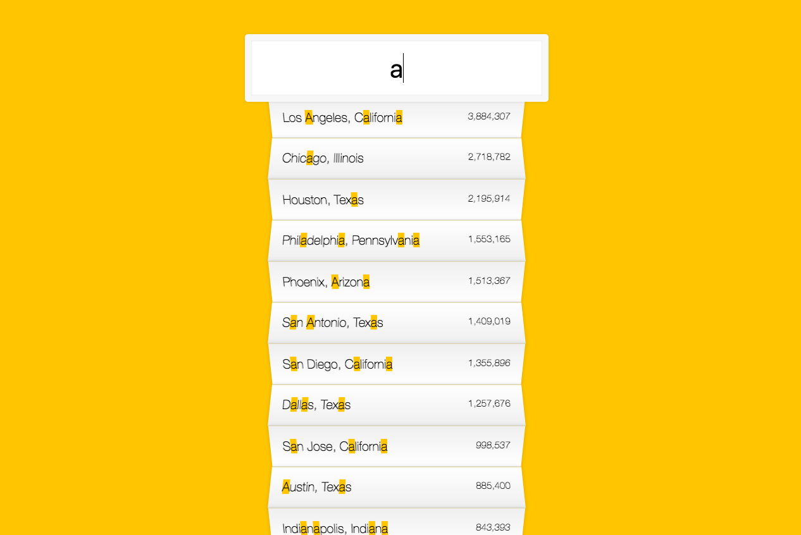

## Key points

1. Use `RegExp` for matching string!
2. You can replacce string with HTMLElement!
    ```js
    const cityName = place.city.replace(regex, `<span class="hl">${this.value}</span>`);
    const stateName = place.state.replace(regex, `<span class="hl">${this.value}</span>`);
    return `
        <li>
            <span class="name">${cityName}, ${stateName}</span>
            <span class="population">${numberWithCommas(place.population)}</span>
        </li>
    `;
    ```
3. `change` event only fire on you lose focus on Input, use `keyup` or `keydown` event for proper listening hanlder
4. ES6 rock, res object from fetech has json() method which also return Promise
    ```js
        fetch(endpoint)
            .then(blob => blob.json())
            .then(data => cities.push(...data));
    ```
5. `text-transform: capitalize;` & `transform: perspective(100px) rotateX(3deg) translateY(2px) scale(1.001);` for fancy list background.


