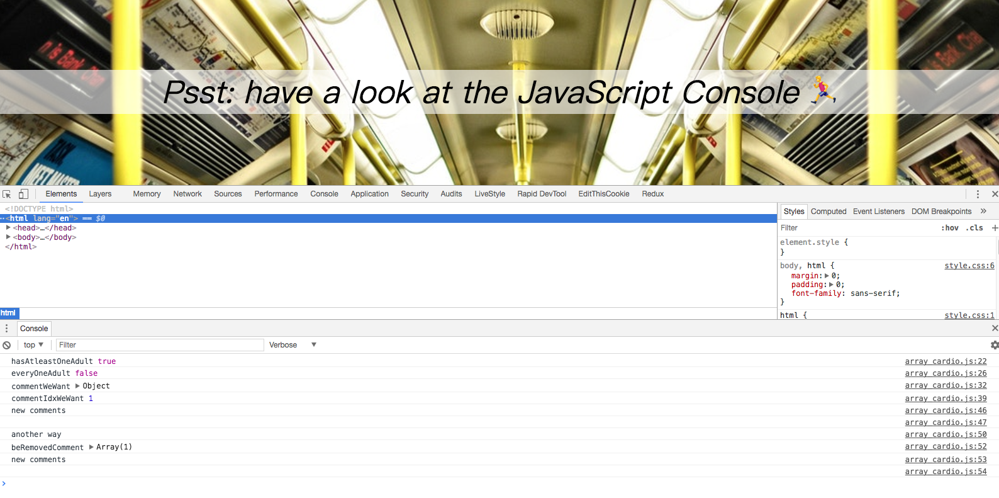

## Note

```js
const newComments = [
    ...comments.slice(0, commentIdxWeWant),
    ...comments.slice(commentIdxWeWant + 1)
];
```

`slice` can pass only one param if second one is `array.length - 1`; (last one in array)

From [MDN](https://developer.mozilla.org/en-US/docs/Web/JavaScript/Reference/Global_Objects/Array/slice):

If end is omitted, slice extracts through the end of the sequence (arr.length).
If end is greater than the length of the sequence, slice extracts through the end of the sequence (arr.length).


