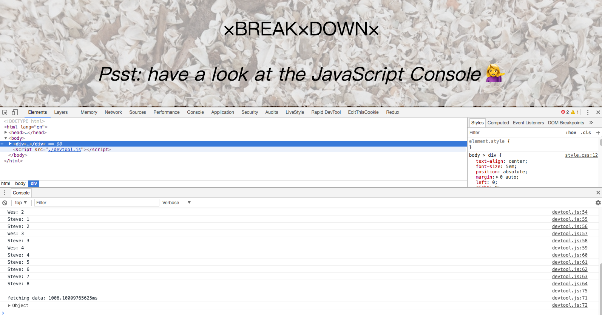

## Note
New things I learned:
1. `group`, `groupCollapsed` and `groupEnd` can make console log grouping together
2. `%c` can color log! ex. `console.log('%c some string', 'font-size:50px; background:red; text-shadow: 10px 10px 0 blue')`
3. Use `console.time` and `console.timeEnd` for logging timing.

