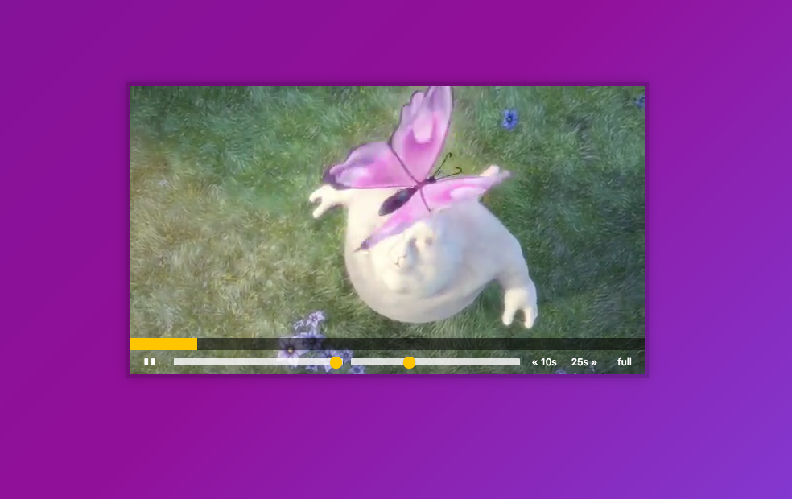

## Key points
1. Video web api has `play`, `pause`, `timeupdate` and `progress` events can be listened.
2. Use `(video.currentTime / video.duration) * 100` to calculate progress bar.
3. Change ` video.currentTime` to fastforwad or rewind.
4. For input slider, we still need to add handler to `change` and `mousemove` since change only be invoked on keyup and value updated.
5. `flexBasis` is useful, parent has 100% `flexBasis`, then children can use `flexBasis` to control length.
6. Use transition for height and position for hide contorl buttons and make some effects.

## Note
1. Fullscreen web api has different vendor prefix. [Full Screen MDN](https://developer.mozilla.org/en-US/docs/Web/API/Fullscreen_API)
2. There are `-webkit-full-screen` and `fullscreen` pseudo elements.
    * It's worth noting a key difference here between the Gecko and WebKit implementations at this time: Gecko automatically adds CSS rules to the element to stretch it to fill the screen: "width: 100%; height: 100%". WebKit doesn't do this; instead, it centers the fullscreen element at the same size in a screen that's otherwise black. To get the same fullscreen behavior in WebKit, you need to add your own "width: 100%; height: 100%;" CSS rules to the element yourself:
    ```css
      #myvideo:-webkit-full-screen {
        width: 100%;
        height: 100%;
      }
    ```
3. Navtive code need to bind the current context!!!
  *. Take `video.webkitRequestFullscreen` to be an example, if we assign `video.webkitRequestFullscreen` to a variable called `requestFullscreen`
  We have to bind `video` to `requestFullscreen`, otherwise we'll get "Uncaught TypeError: Illegal invocation"
We have to bind `video` to `requestFullscreen`, otherwise we'll get "Uncaught TypeError: Illegal invocation"


