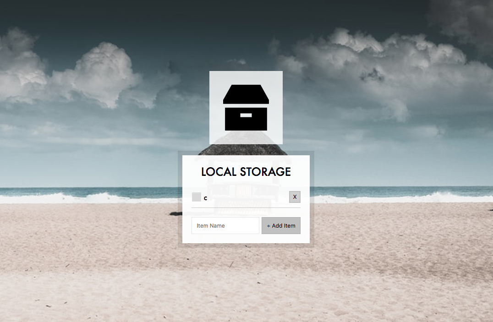

## Key points

1. tips: hide the original input button, then use pesudo element for styling.
    ```css
    .plates input + label:before {
        content: '⬜️';
        margin-right: 10px;
    }
    ```
2. localStorage can only store string, stingify before saving.
3. Form element has `reset()` method can clear all contents in form.
    ```js
    function formEventListener(e) {
        e.preventDefault();
        //...
        //..
        //.
        this.reset(); // this refer to form element(e.target)
    }
    ```
4. [Event delegation] Instead of binding handler to `li`, we should binding to `ul` for proper event delegation, we can take `li` as children that need parent `ul` to handle. When `li` click event bubble up to `ul`, that's where we can handle it.
5. Use `e.target.matches()` to find out which target be invoked.


Reference:
Different way of registering JS event: http://blog.xuite.net/vexed/tech/25248659-%E6%B7%BA%E8%AB%87+JavaScript+%E7%9A%84+DOM+Event+%E8%A8%BB%E5%86%8A%E6%96%B9%E5%BC%8F

JS event delegation:
http://ithelp.ithome.com.tw/articles/10120565


