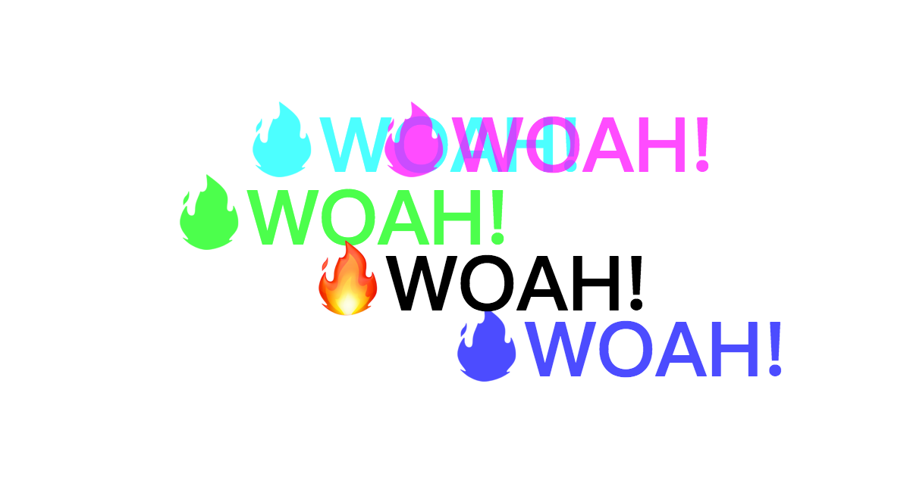

## Key points
1. `e.target.offsetLeft` is an integer representing the offset to the left in pixels from the **closest relatively positioned parent**

2. In event listener, `this` represent the element you register with listener, `e.target` represent the element who be triggered, they may not be same.

3. `e.offsetX` is an experimental technology, give us the offset in the X coordinate of the mouse pointer between that event and the padding edge of the target node. 

4. As 2. describes, since `this` may not equal to `e.target`, then `e.target.offsetLeft` may not be the value we want, need to do some math to get the correct value:
    ```js
    // Add extra e.target.offsetLeft back to e.offsetX
    // so that we can get the actual mouse pointer position
    x = x + e.target.offsetLeft;
    ```


