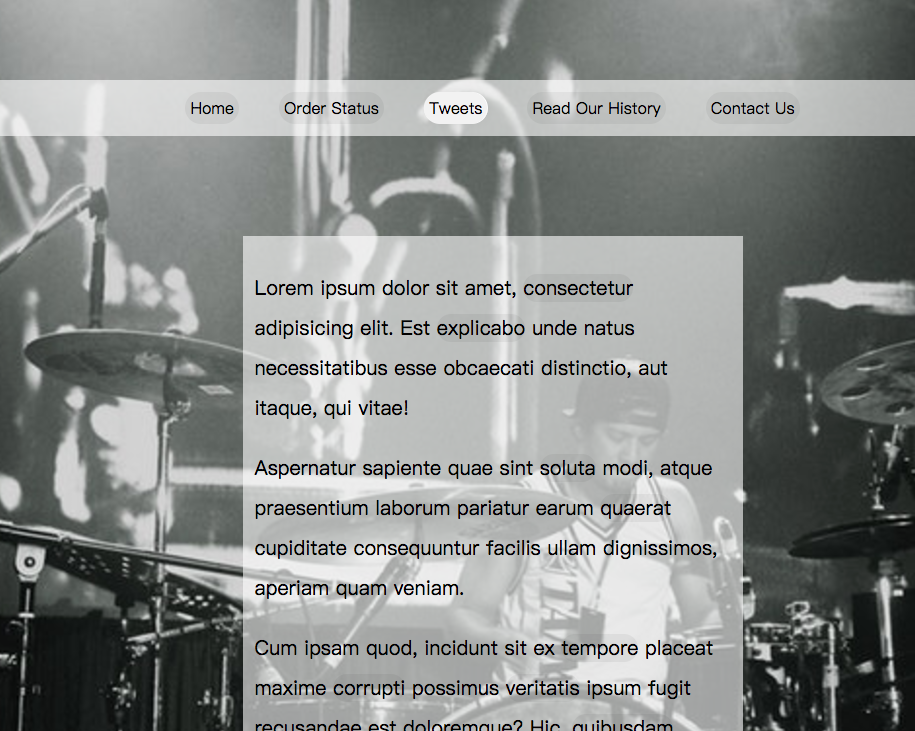

## Key point

* Use `getBoundingClientRect` for element position and width and height.
* You may only need to caculate with `window.scrollY` or `window.scrollX`
* Be careful about any window resize, window scroll event, all these change may causing your style or function broke.

