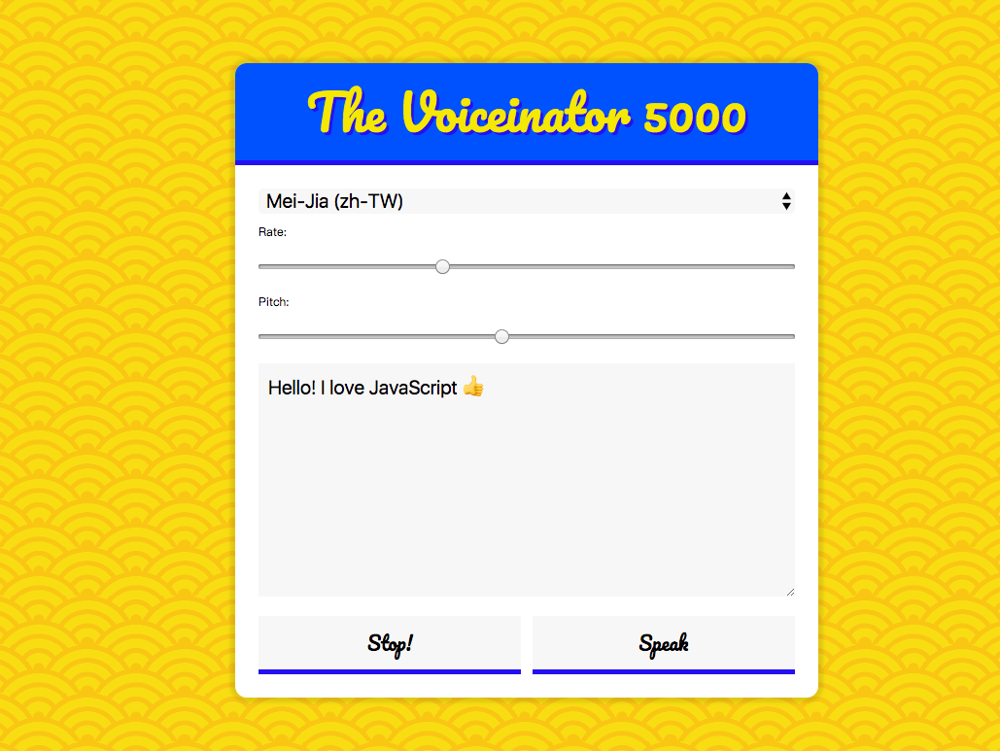

## Key points
* `speechSynthesis` and `SpeechSynthesisUtterance` both are Web Speech API (source: [MDN](https://developer.mozilla.org/en-US/docs/Web/API/SpeechSynthesis))
* `SpeechSynthesis.onvoiceschanged` and `SpeechSynthesis.getVoices()` are most important part:
    `getVoices()` will return list of SpeechSynthesisVoice objects representing all the available voices on the current device.
    `voiceschanged` event fired when the list of SpeechSynthesisVoice objects that would be returned by the SpeechSynthesis.getVoices() method has changed.
* `SpeechSynthesisUtterance` represents a speech request. It contains the content the speech service should read and information about how to read it (e.g. language, pitch and volume.)
    use instance of `SpeechSynthesisUtterance` to set voice and text, let your device talk!

* `querySelectorAll` can use `,` to separate different selectors!

