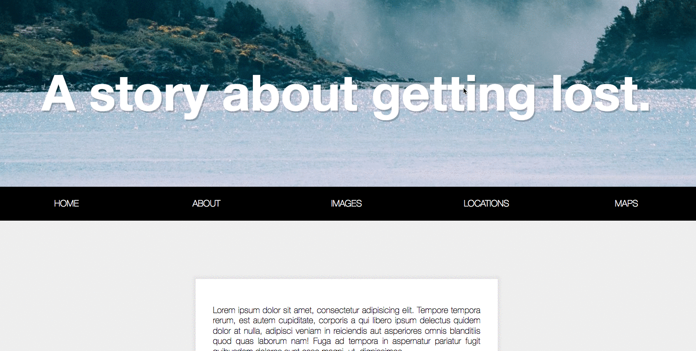

## Key points
* When nav become position fix, you have to add extra padding (same height with nav, `nav.offsetHeight`) to fill up the vacancy.
* If you use pure css (for instance, not atomic), then you can add special class name on `body`, in this way, you can control all elements' style under body when fix nav.
* How to evaluate if nav should be fixed? use `window.scrollY >= nav.offsetTop`

