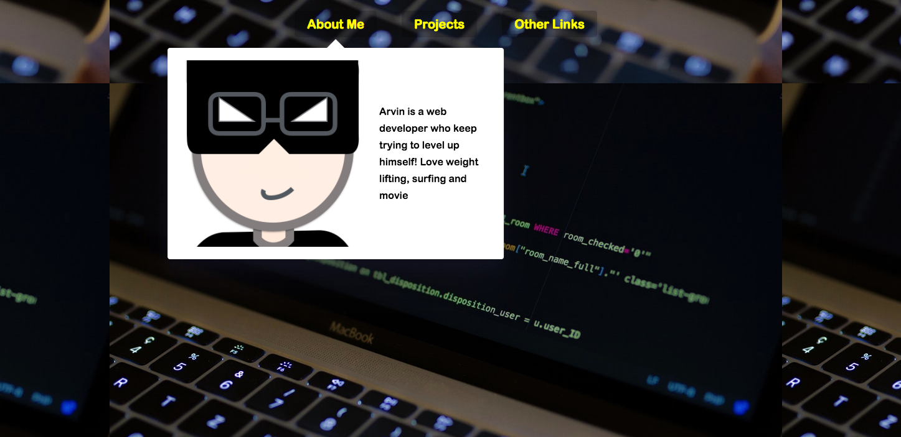

## Key points
* Use one common element to transition for displaying different blocks
* Use `getBoundingClientRect()` to get elements' height, width and position
* Always remember to take layout into consideration when you calculate element position. ex. `top: dropdownCoords.top - navCoords.top`
* We know that we can't animate `display:none` -> `display:block`, we need to use opacity, but we still can use extra css class style to contorl display.
    Why? because we can leaverage this extra class to prevent from messing up css class add/remove when user mouseover it quickly.
    `setTimeout(() => this.classList.contains('trigger-enter') && this.classList.add('trigger-enter-active'), 150);`

