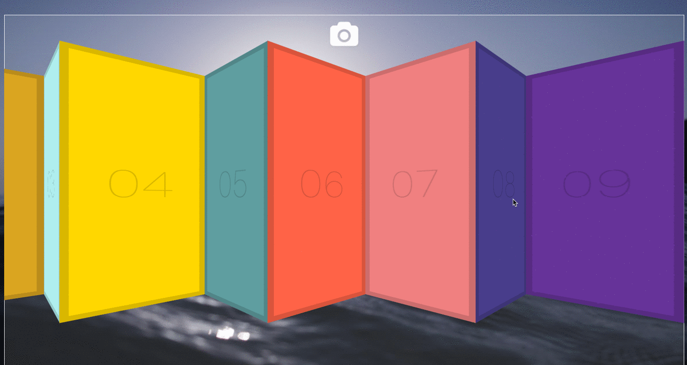

## Key points
* Use [perspective](https://developer.mozilla.org/en-US/docs/Web/CSS/perspective) to css transform elements, that's how you make effect like book pages(http://www.w3school.com.cn/tiy/t.asp?f=css3_perspective1)
* Use a global variable `isDown` to control if we need execute function in `mousemove` event.
* `startX = e.pageX - slider.offsetLeft;` use e.pageX to get cursor position relative to whole page, but we have to minus offset from left to the slider border which is `slider.offsetLeft`, for example, we set an extra margin on slider, we have to minus it.
```
                  ------------------------
                  |                      |
 <--- slider. --->|<---------> .(e.pageX)|
       offsetLeft |  startX              |
                  ------------------------
```
* `e.preventDefault();` // stop any selecting text or other browser default behavior.
* When mouse move, re-calculate cursor position `X` and minus origin start point `startX` to get how far you `walk through`
```js
    const x = e.pageX - slider.offsetLeft; // re-calculate cursor position
    const walk = (x - startX) * 3;
```
* Remeber to use origin offsetLeft to minus walk steps `slider.scrollLeft = scrollLeft - walk;` for getting correct scrollLeft value;
* You can add or multiply `walk` to speed up your scroll.



