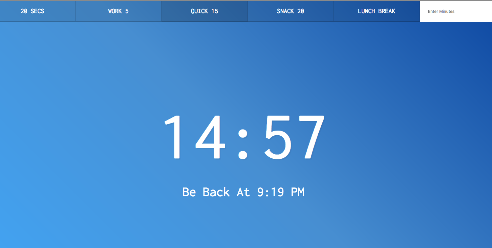

## key points
1. `this.dataset` refer to elements' data attribute:
    ```html
    <button data-time="900" class="timer__button">Quick 15</button>
    ```
    ```js
    this.dataset.time equal to 900
    ```
2. Can change page title by modified `document.title` 
3. Elements with name will be under `document`, you can use `document.[name]` to select elements 
4. use `e.preventDefault` in `submit` can prevent it append params on url


