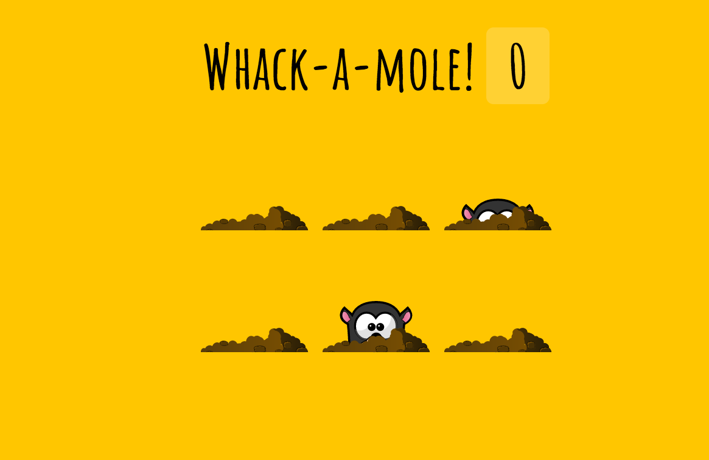

## key points

1. You can use `e.isTrusted` to detect if event is issued by JS not native
2. Recursive function call to solve got same hole issue in `randomHole`
3. Use global variable for controlling game timesup.

